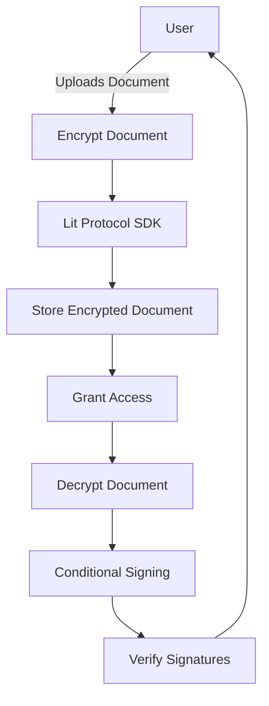

# Secure Document Sharing and Signing with Lit Protocol


## Overview

This project demonstrates a secure document sharing and signing application using the Lit Protocol. The application allows users to encrypt documents, share them securely, and enable conditional signing based on specific conditions such as having a minimum Ethereum balance.

## How We Used Lit Protocol

The Secure Document Sharing and Signing application leverages the Lit Protocol for:

- **Document Encryption**: Encrypting documents using Lit Protocol's encryption capabilities.
- **Document Decryption**: Decrypting documents with Lit Protocol's decryption capabilities.
- **Conditional Signing**: Signing documents conditionally based on user criteria (e.g., Ethereum balance).

### Diagram



## Features

- **Document Encryption**: Encrypt documents using Lit Protocol.
- **Document Decryption**: Decrypt documents with the appropriate symmetric key.
- **Conditional Signing**: Sign documents if specific conditions are met.
- **Basic UI**: Simple user interface for interacting with the application.

## Prerequisites

- Node.js installed
- Yarn or npm installed

## Setup

1. **Clone the Repository**:

    ```bash
    git clone <repository-url>
    cd secure-doc-sharing
    ```

2. **Install Dependencies**:

    ```bash
    yarn install
    ```

    or

    ```bash
    npm install
    ```

3. **Run the Server**:

    ```bash
    node server/server.js
    ```

4. **Run Webpack Dev Server**:

    ```bash
    npx webpack serve
    ```

## File Structure

secure-doc-sharing/
├── public/
│ ├── index.html
│ ├── styles.css
├── src/
│ ├── index.js
│ ├── App.js
│ ├── EncryptDocument.js
│ ├── DecryptDocument.js
│ ├── ConditionalSign.js
├── server/
│ ├── server.js
│ ├── upload.js
├── .babelrc
├── webpack.config.js
├── package.json


## Usage

### Encrypt Document

1. Enter the document content in the "Encrypt Document" section.
2. Click the "Encrypt" button.
3. The encrypted document and symmetric key will be displayed.

### Decrypt Document

1. Enter the encrypted document and symmetric key in the "Decrypt Document" section.
2. Click the "Decrypt" button.
3. The decrypted document will be displayed.

### Conditional Sign Document

1. Enter the document content in the "Conditional Sign Document" section.
2. Click the "Sign" button.
3. The signature will be displayed if the conditions are met.

## Technology Stack

- React
- Express
- Lit Protocol SDK
- Webpack
- Babel

## Contributing

Feel free to open issues or submit pull requests for improvements or bug fixes.

## License

This project is licensed under the MIT License.

---

### Diagram

```mermaid
graph TD
    A[User] -->|Uploads Document| B[Encrypt Document]
    B --> C[Lit Protocol SDK]
    C --> D[Store Encrypted Document]
    D --> E[Grant Access]
    E --> F[Decrypt Document]
    F --> G[Conditional Signing]
    G --> H[Verify Signatures]
    H --> A

